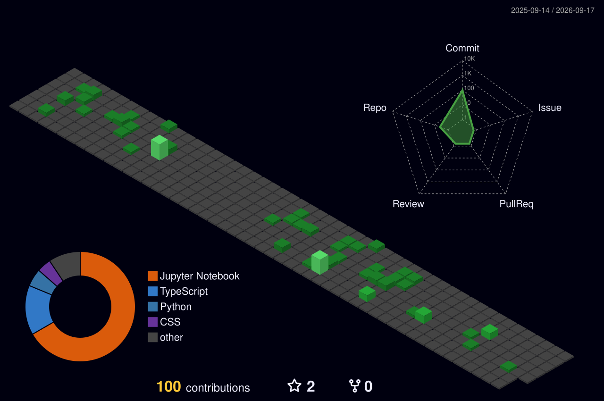

  

  <h1>Hi there, I'm Marcus Neto 👋</h1>

  

  

    Building scalable, well-structured software with practical experience across
    <b>Web Development</b>, <b>Desktop Applications</b>, <b>Image Processing</b> and <b>Deep Learning</b>.
  

  

    
    
    
    
    
  

  

 

## 🚀 Skills

**Languages**

**Web**

## 🛠️ Tools & Environment

  
  
  
  
  
  
  
  
  

 

## 📊 GitHub Stats

  
  

  

  

  

 

## 💼 Experience

<b>Development Internship — C++ & Python</b> · Esteio Engenharia e Aerolevantamentos S.A.

 
Software development focused on system functionality, automation, and performance optimization.

 

<b>Health Tech Internship</b> · Erasto Gaertner Hospital

 
Improvements to the radiotherapy scheduling system, dashboard creation, and routine automation.

 

<b>Scientific Initiation</b> · CEPAG - UFPR

 
Development of projects for university and commercial use — platforms, systems, and applications.

 

<b>Scientific Initiation — AI/Computer Vision</b> · UFPR

 
Research on vehicle license plate recognition (color, model, year, type) using image processing and convolutional neural networks.

 

<b>Core Development</b> · Frontend & Backend

 
Building dynamic and responsive applications across the full stack.

 

<b>Desktop Development</b>

 
Developing robust, user-friendly desktop applications.

 

## 📚 Education

**Biomedical Informatics** — Federal University of Paraná (UFPR) 🎓

 

  

