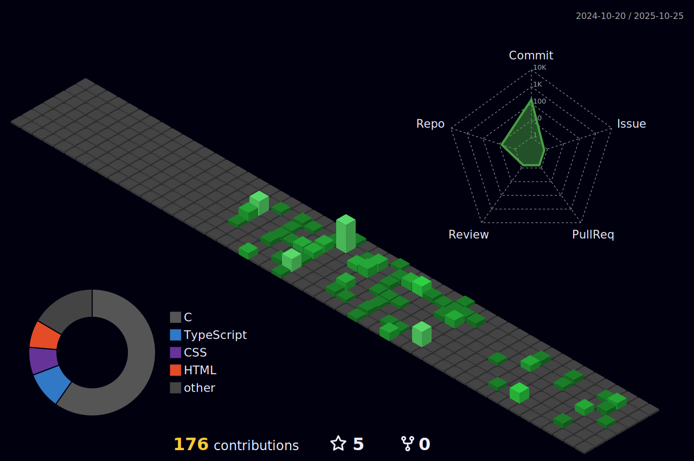

  # Hi there, I'm Marcus Neto! 👋

  
  
  

    I am a <b>Biomedical Informatics</b> student at <b>UFPR</b> with practical experience in  
    <b>Web Development</b>, <b>Desktop Applications</b>, <b>Image Processing</b> and <b>Deep Learning</b>.
  

  
  

    Working on both the <b>Backend</b> and <b>Frontend</b>. I have a solid background in programming and use 
    <b>Object-Oriented Programming (OOP)</b> principles to create scalable and well-structured solutions.
  

  

    
    
    
    
    
  

 

## Skills 🚀

  
  
  
  
  
  
  
  
  
  

## Tools 🛠️

  
  
  
  
  
  
  
  

 

##  GitHub Stats 📊

  

 

## Experience 💼

 

| Role / Topic | Description |
| :--- | :--- |
| **Development Internship C++ & Python** | *Esteio Engenharia e Aerolevantamentos S.A.*   Software development with a focus on system functionality, automation, and performance optimization. 🧠💻 |
| **Internship (Health Tech)** | *Erasto Gaertner Hospital*   Improvement in the radiotherapy scheduling system, creation of dashboards and automation of routines. |
| **Scientific Initiation** | *CEPAG - UFPR*   Development of projects for university and commercial use, platforms, systems, and applications. |
| **Scientific Initiation (AI/CV)** | *UFPR*   Research in vehicle license plate recognition, color, model, year, and type. Image processing and convolutional neural networks. |
| **Core Dev** | **Frontend & Backend Development**: Creating dynamic and responsive applications. 📱 |
| **Desktop Dev** | **Desktop Applications**: Developing robust and user-friendly desktop applications. 🖥️ |

 

## Education 📚 

### Biomedical Informatics 🎓 
**Federal University of Paraná (UFPR)**

 

  

